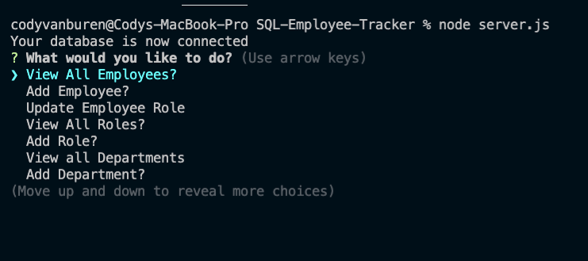
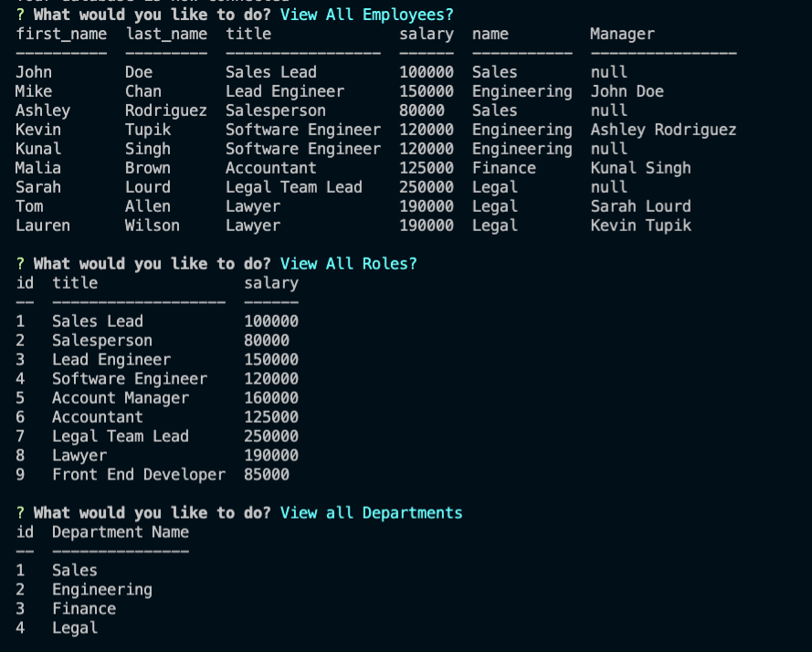
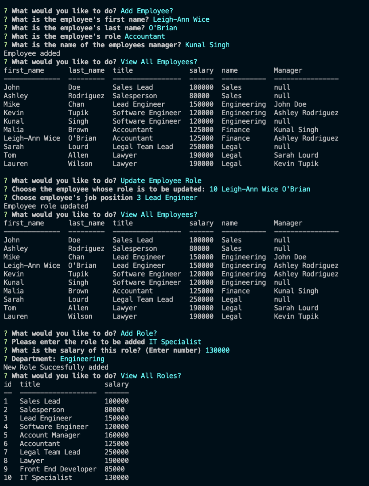
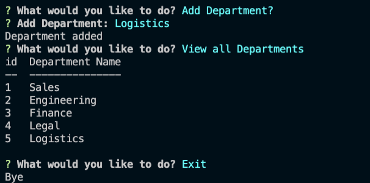

# SQL-Employee-Tracker
---
[](https://opensource.org/licenses/MIT)

## Table of Contents:
- [Description](#description)
- [Installation](#installation)
- [Technologies](#technologies)
- [Usage](#usage)
- [Testing](#testing)
- [Screenshots](#Screenshots)
- [Additional-Info](#additional-info)

---

## Description:

This is an employee tracker command line application that is run on the back end. The application allows a user to track their employees, roles, role salaries, as well as, add roles, departments, and employees. The application will then take the user inputs and place them in the database and return out specific tables that shows the queries of the database that the user chooses.

---

## Technologies:
```
- Javascript
- Node
- SQL
- Inquirer
- Console.table
```

---

## Installation: 
```
Clone the repo and then run npm install in an integrated terminal. Then run node.
``` 

---

## Usage: 

This application has several uses such as: View all Employees, View all Roles, View All Departments, Add department, add role, update employee roles and add employees.

---

## Testing:

There are no built in tests for this project, but there are input validations. 

## Screenshots:







---

## Additional Info:
- Github: [bvanburenwx](https://github.com/bvanburenwx)
- Email: bvanburenwx@gmail.com
- Application Walkthrough: [Walkthrough](https://drive.google.com/file/d/1VXp5zCEVs0tbPBNFYHIl5SMHQd6qTFCg/view)

